# Introduction to Bootstrap


Link to this workshop:
TODO: INCLUDE FINAL LINK HERE

**Table of Contents**
- [Prerequisites](#prerequisites)
- [Tips and Tricks](#tips-and-tricks)
- [Adding Bootstrap](#adding-bootstrap-to-your-project)
  - [Downloading Bootstrap](#downloading-bootstrap)
  - [Linking to a Content Delivery Network](#linking-to-a-content-delivery-network)
- [Using Bootstrap](#using-bootstrap-in-your-project)
  - [Quick Review](#quick-review)
  - [Jumbotrons](#jumbotrons-with-bootstrap)
  - [Buttons](#buttons-with-bootstrap)
  - [Navbars](#navbars-with-bootstrap)
  - [Using the Documentation](#using-the-bootstrap-documentation)
- [Troubleshooting](#troubleshooting)
- [Celebration](#congratulations)

## What is Bootstrap?

Bootstrap is an HTML, CSS, and JS framework for developing responsive and appealing websites, quickly and easily.  It allows you to produce sites that work on both mobile devices and computers, and it helps with some repetitive styling tasks.

**Important**: if you're having trouble, checkout the [troubleshooting](#troubleshooting) section at the end of the workshop.

## Prerequisites

A Basic understanding of HTML and CSS is required to complete this workshop

## Tips and Tricks

To open a link in another tab, right click on the link and select 'Open In New Tab'.

## Adding Bootstrap to your project

There are multiple ways to add bootstrap to your project here we will go over two of the more popular ways

- [Downloading Bootstrap](#downloading-bootstrap)
- [Linking to a Content Delivery Network](#linking-to-a-content-delivery-network)

### Downloading Bootstrap

To download bootstrap, go to the [bootstrap website](https://getbootstrap.com), and click the "Download Bootstrap" button

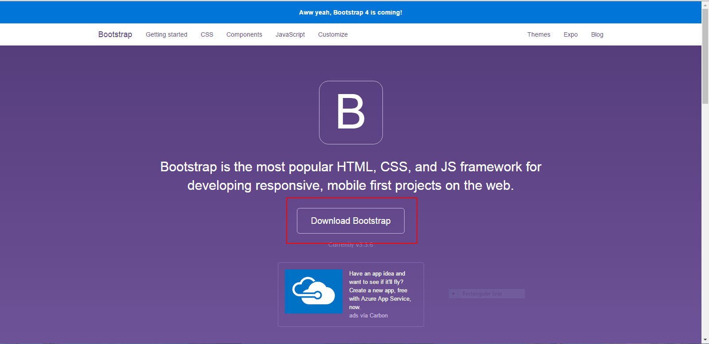

And "Download Bootstrap" again on the following page

After the download finishes navigate to the file in your downloads folder either by using your file explorer, or by right clicking on the download and clicking on "Show in Folder"

Unzip the downloaded folder using your favorite extraction software, or just double click on it, and click "extract all" at the top if you are using Windows

I would recommend renaming the folder to "bootstrap to avoid naming differences in versions".

When moving the folder, drag the inside folder out of the two, so that the content inside has 3 folders, "css","js", and "fonts".

If you are using the [Cloud9 IDE](https://c9.io), open up your project and drag the downloaded folder into your project

*See [this](https://github.com/hackclub/hackclub/blob/master/workshops/cloud9/README.md) workshop if you want to use Cloud9, but don't know how*

If you are not using Cloud9, place the bootstrap folder wherever you are saving the project on your local machine

Set up your project like you normally would with your index.html file, and all of your CSS, and JavaScript files.  If you don't know how to do that, check out [this](https://github.com/hackclub/hackclub/tree/master/workshops/cloud9#using-html-css-and-javascript-together-in-cloud9) workshop to learn how (Although the workshop is intended to be used with the Cloud9 IDE, setting up the files is the same for any project)

Now what we need to do is link the Bootstrap CSS and JavaScript projects in our index.html file

**Linking to the Downloaded Bootstrap files**

In between the header tags in the index.html file, add the following code:

```html
<link rel="stylesheet" href="./bootstrap/css/bootstrap.min.css" type="text/css">
<link rel="stylesheet" href="./bootstrap/css/bootstrap-theme.min.css" type="text/css">
```

_if you did not rename your bootstrap folder, make sure to replace "bootstrap" with the original name of the folder_

In between the body tags in the index.html file, add the following

```html
<script   src="https://code.jquery.com/jquery-2.2.4.min.js"   integrity="sha256-BbhdlvQf/xTY9gja0Dq3HiwQF8LaCRTXxZKRutelT44="   crossorigin="anonymous"></script>
<script type="text/javascript" src="./bootstrap/js/bootstrap.min.js"></script>
```

_if you did not rename your bootstrap folder, make sure to replace "bootstrap" with the original name of the folder_

Congratulations, you have successfully added bootstrap to your project

### Linking to a Content Delivery Network

If you just downloaded bootstrap, you do not also have to link to a content delivery network, you only have to choose one of these options.

Set up your project like you normally would with your index.html file, and all of your CSS, and JavaScript files.  If you don't know how to do that, check out [this](https://github.com/hackclub/hackclub/tree/master/workshops/cloud9#using-html-css-and-javascript-together-in-cloud9) workshop to learn how (Although the workshop is intended to be used with the Cloud9 IDE, setting up the files is the same for any project)

**Linking to the Content Delivery Network**

In between the header tags in the index.html file, add the following code:

```html
<link rel="stylesheet" href="https://maxcdn.bootstrapcdn.com/bootstrap/3.3.6/css/bootstrap.min.css" integrity="sha384-1q8mTJOASx8j1Au+a5WDVnPi2lkFfwwEAa8hDDdjZlpLegxhjVME1fgjWPGmkzs7" crossorigin="anonymous">
<link rel="stylesheet" href="https://maxcdn.bootstrapcdn.com/bootstrap/3.3.6/css/bootstrap-theme.min.css" integrity="sha384-fLW2N01lMqjakBkx3l/M9EahuwpSfeNvV63J5ezn3uZzapT0u7EYsXMjQV+0En5r" crossorigin="anonymous">
```

In between the body tags in the index.html file, add the following code:

```html
<script   src="https://code.jquery.com/jquery-2.2.4.min.js"   integrity="sha256-BbhdlvQf/xTY9gja0Dq3HiwQF8LaCRTXxZKRutelT44="   crossorigin="anonymous"></script>
<script src="https://maxcdn.bootstrapcdn.com/bootstrap/3.3.6/js/bootstrap.min.js" integrity="sha384-0mSbJDEHialfmuBBQP6A4Qrprq5OVfW37PRR3j5ELqxss1yVqOtnepnHVP9aJ7xS" crossorigin="anonymous"></script>
```

Congratulations, you have successfully added bootstrap to your project

## Using Bootstrap in your project
Right now your html should probably look a little something like this:

```html
<!DOCTYPE html>
<html>
    <head>
        <link rel="stylesheet" href="./bootstrap/css/bootstrap.min.css" type="text/css">
        <link rel="stylesheet" href="./bootstrap/css/bootstrap-theme.min.css" type="text/css">
        <link rel="stylesheet" href="style.css" type="text/css">
    </head>
    <body>
        <script   src="https://code.jquery.com/jquery-2.2.4.min.js"   integrity="sha256-BbhdlvQf/xTY9gja0Dq3HiwQF8LaCRTXxZKRutelT44="   crossorigin="anonymous"></script>
        <script type="text/javascript" src="./bootstrap/js/bootstrap.min.js"></script>
        <script type="text/javascript" src="index.js"></script>
    </body>
</html>
```

or this:

```html
<!DOCTYPE html>
<html>
    <head>
        <link rel="stylesheet" href="https://maxcdn.bootstrapcdn.com/bootstrap/3.3.6/css/bootstrap.min.css" integrity="sha384-1q8mTJOASx8j1Au+a5WDVnPi2lkFfwwEAa8hDDdjZlpLegxhjVME1fgjWPGmkzs7" crossorigin="anonymous">
        <link rel="stylesheet" href="https://maxcdn.bootstrapcdn.com/bootstrap/3.3.6/css/bootstrap-theme.min.css" integrity="sha384-fLW2N01lMqjakBkx3l/M9EahuwpSfeNvV63J5ezn3uZzapT0u7EYsXMjQV+0En5r" crossorigin="anonymous">
        <link rel="stylesheet" href="style.css" type="text/css">
    </head>
    <body>
        <script   src="https://code.jquery.com/jquery-2.2.4.min.js"   integrity="sha256-BbhdlvQf/xTY9gja0Dq3HiwQF8LaCRTXxZKRutelT44="   crossorigin="anonymous"></script>
        <script src="https://maxcdn.bootstrapcdn.com/bootstrap/3.3.6/js/bootstrap.min.js" integrity="sha384-0mSbJDEHialfmuBBQP6A4Qrprq5OVfW37PRR3j5ELqxss1yVqOtnepnHVP9aJ7xS" crossorigin="anonymous"></script>
        <script type="text/javascript" src="index.js"></script>
    </body>
</html>
```

Depending on whether you downloaded bootstrap or used a CDN

We don't need any CSS or JavaScript yet

Now we are going to use bootstrap to make a simple website

### Quick Review

In HTML we can use classes and ids to access elements in CSS and JavaScript

To assign a class to an element you set the class attribute of that element to the name of the class you wish to assign

For example:
```html
<div class="YOUR-CLASS-NAME-HERE"></div>
```

Class Names are separated by a space

Ids work in exactly the same way

For example:
```html
<div id="YOUR-ID-NAME-HERE"></div>
```

One big difference between classes and ids is that you can have multiple classes for one element, but while you can have multiple ids for a single element using some tricks, you generally shouldn't

Bootstrap works through having you add classes to elements, and it applies styles to those elements

### Making a Website with Bootstrap

To start designing your site, you have to choose a topic that you are passionate about, that you want to make into a website

I personally love socks

### Jumbotrons with Bootstrap

Sometimes you really want to catch the eye of the person coming to your website, with a big display

[Here](https://getbootstrap.com/examples/jumbotron/) is an example of a site with a jumbotron

To add a jumbotron to your site go to the body tags of the index.html, and add a div with the class of jumbotron

```html
<div class="jumbotron">

</div>
```

Inside of that div, add another div with the class of container

```html
<div class="jumbotron">
  <div class="container">

  </div>
</div>
```

Bootstrap recognizes that we want to have a jumbotron on our site with content inside of the container div

Now you can add whatever you want to this div, I want a header explaining what my site will be about with a description below it

To do this, I will add this code inside of the container div

```html
<h1>SOCKS</h1>
<p>The warm smooth feeling of socks will brighten anyone's day.</p>
```

Now my site looks like this:

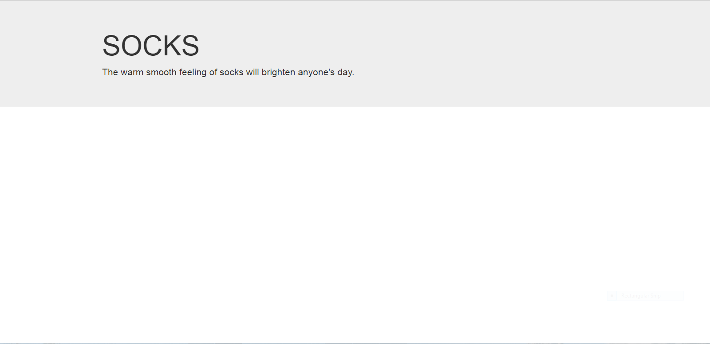

That looks alright, but I want to center this content, I can do that with regular CSS

To do this go to your CSS file, and add the following code:

```css
.jumbotron {
  text-align:center;
}
```
**Understanding the code:**
> We select the jumbotron using it's class, but putting a "." next to the class name.
> This indicates to the css that what goes inside the squiggly braces, we want to apply to everything with the jumbotron class.
> The text-align property determines where to put elements inside of a parent elements.
> Setting this to center shifts everything to the center inside of the jumbotron div.

Now my site looks like this:

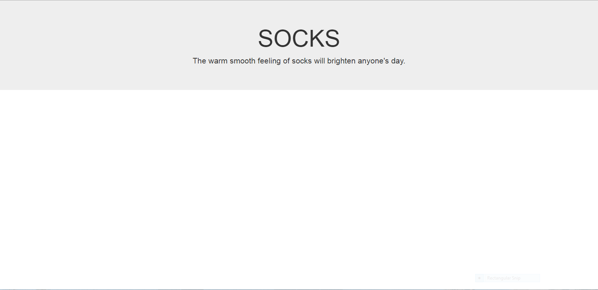

Congratulations, you have successfully added a jumbotron to your website

### Buttons with Bootstrap

Buttons are a very important component of any website.

Having the appropriately styled button for a certain circumstance can make or break a solid website design.  Luckily for us, bootstrap can help with this

I want to add a button to my jumbotron allowing my user to learn more about socks

I will start by adding a regular button to my jumbotron

```html
<button>Learn More</button>
```

Now my site looks like this:

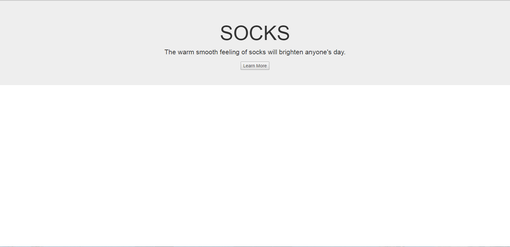

Sure that would work for most articles of clothing, but we are talking about socks here, I need something a bit more interesting

Here are the types of button styles that bootstrap makes for us

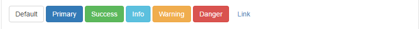

I like the primary type for my website, but you could choose whichever you like best

To apply this type I am going to add two classes to my button, the "btn" class and the "btn-primary" class

If you want to choose a different style, use the name of the style instead of primary

```html
<button class = "btn btn-primary">Learn More</button>
```

Now my site looks like this:

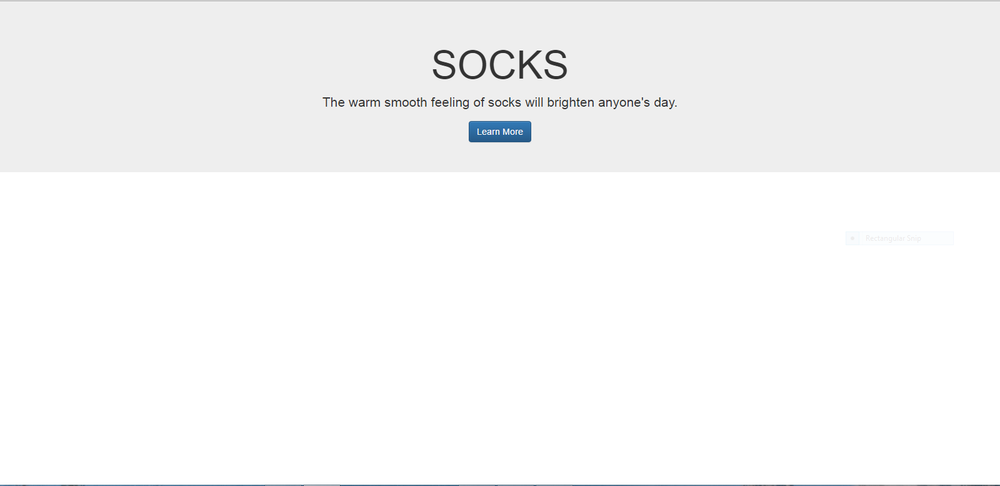

I like that much better, but I really want people to notice my button, maybe making it a bit bigger would catch people's attention

Once again bootstrap comes to the rescue

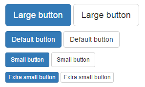

To make my button larger, all I need to do is add one more class to my button, the "btn-lg" class

If you want to make your button any of the other sizes, all you have to do is add the following classes

| Size | Classes |
|-------------|------------------------|
| Large | btn-lg |
| Default | NO NEED TO ADD A CLASS |
| Small | btn-sm |
| Extra-Small | btn-xs |

```html
<button class="btn btn-primary btn-lg"></button>
```

Now my site looks like this

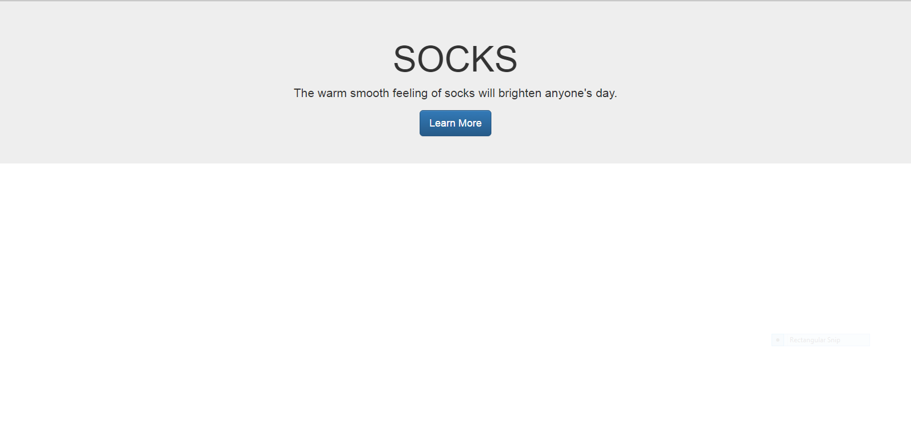

This is not the point of this workshop, so I will not go into detail, but I am going to add functionality to the button

If you want to learn more about this topic, check out [this](https://github.com/hackclub/hackclub/tree/master/workshops/that_was_easy) workshop

Add an id to your button like so

```html
<button id = "learnMore" class="btn btn-primary btn-lg"></button>
```

This will allow us to find this button in our JavaScript

Now in your JavaScript file add this code:

```js
document.getElementById("learnMore").onclick = function(){
  document.location = "https://en.wikipedia.org/wiki/Sock";
};
```

Replace https://en.wikipedia.org/wiki/Sock with a link relevant to your topic.  Remember to keep the quotation marks around it.

Congratulations, you have successfully added a button to your site

### Navbars with Bootstrap

When making a website, one thing that is completely essential is a navigation bar, to switch between pages on the site.  Bootstrap makes this extremely easy

To start off, we will want to go inside of the body tags and add a nav element at the top, above everything else

```html
<nav>

</nav>
```

We will add two classes to the navbar "navbar" and "navbar-default"

```html
<nav class = "navbar navbar-default">

</nav>
```

Now bootstrap knows that we want a navbar, with the default style

Inside the nav, add a div with the class "container-fluid"

```html
<nav class = "navbar navbar-default">
 <div class="container-fluid">

 </div>
</nav>
```

Much like the container class from earlier this sets up an area for us to put the content, but by adding -fluid, the container now extends the entire width of the parent element.

Next, we will place two divs inside of the container div

```html
<nav class = "navbar navbar-default">
 <div class="container-fluid">
   <div>

   </div>
   <div>

   </div>
 </div>
</nav>
```

We will add the class "navbar-header" to the first div.  This will be where we put the logo, and dropdown button for our div

```html
<nav class = "navbar navbar-default">
 <div class="container-fluid">
   <div class = "navbar-header">

   </div>
   <div>

   </div>
 </div>
</nav>
```

Add the following code inside of the navbar-header div

```html
<button type="button" class="navbar-toggle collapsed" data-toggle="collapse" data-target="#sock-navbar" aria-expanded="false">
  <span class="icon-bar"></span>
  <span class="icon-bar"></span>
  <span class="icon-bar"></span>
</button>
```

Replace "#sock-navbar" with any name that you want for your navbar.  Be creative, it doesn't even have to end in -navbar.  Just remember the name later, and keep the # in front.

**Understanding The Code:**
> We create a button that toggles the navbar, and only shows when the screen is small enough to be collapsed.  We give it a target to open and close when clicked on.
> Each icon-bar span is a horizontal line, so the button that expands and collapses the navbar is a square with 3 stacked lines.  This is a pretty standard look for things
> that expand and collapse, so the user of the website should recognize the button for what it is used for.

Beneath the button add a link (With the a tag).  This will act as a the sites logo, and take the person who clicks it back to the home page

```html
<a class="navbar-brand" href="#">Sock Lovers</a>
```

You can replace the Sock Lovers, with whatever you want the name of your site to be.  The navbar-brand class lets bootstrap know that you are setting up the logo or brand for the website.  If this navbar were to be on a different page of the website and not the homepage, you would add the link to the homepage instead of the "#"

Your navbar should now look like this, with minor differences where things have different names

```html
<nav class = "navbar navbar-default">
 <div class="container-fluid">
   <div class = "navbar-header">
     <button type="button" class="navbar-toggle collapsed" data-toggle="collapse" data-target="#sock-navbar" aria-expanded="false">
       <span class="icon-bar"></span>
       <span class="icon-bar"></span>
       <span class="icon-bar"></span>
     </button>
     <a class="navbar-brand" href="#">Sock Lovers</a>
   </div>
   <div>

   </div>
 </div>
</nav>
```

Now we are going to fill the empty div with the links for pages on our site

Add two classes to the div, the "collapse" class and the "navbar-collapse" class

Our div should look like this:

```html
<div class = "collapse navbar-collapse">

</div>
```

Add an id to the div, with the same name you made with the button, this time without the # in front

```html
<div class = "collapse navbar-collapse" id = "sock-navbar">

</div>
```

Inside of the div we will want to add an unordered list element with the ul tags

```html
<div class = "collapse navbar-collapse" id = "sock-navbar">
  <ul>

  </ul>
</div>
```

Add two classes to the ul element, the "nav" class and the "navbar-nav" class

```html
<div class = "collapse navbar-collapse" id = "sock-navbar">
  <ul class = "nav navbar-nav">

  </ul>
</div>
```

Now we will add li elements inside the ul in order to add links to the navbar

Add one of these to the ul for each
```html
<li><a href="#">Flip flop socks</a></li>
```

Replace Flip flop socks, with whatever name of the page you want, and once you have added these pages to your website replace # with the link to the page

Your nav element should now look like this (besides naming differences):

```html
<nav class="navbar navbar-default">
   <div class="container-fluid">
     <div class="navbar-header">
       <button type="button" class="navbar-toggle collapsed" data-toggle="collapse" data-target="#sock-navbar" aria-expanded="false">
         <span class="icon-bar"></span>
         <span class="icon-bar"></span>
         <span class="icon-bar"></span>
       </button>
       <a class="navbar-brand" href="#">Sock Lovers</a>
     </div>
     <div class="collapse navbar-collapse" id="sock-navbar">
       <ul class="nav navbar-nav">
         <li><a href="#">Flip flop socks</a></li>
         <li><a href="#">Toe socks</a></li>
         <li><a href="#">Knee socks</a></li>
         <li><a href="#">Normal socks</a></li>
       </ul>
     </div>
   </div>
</nav>
```

My site now looks like this:

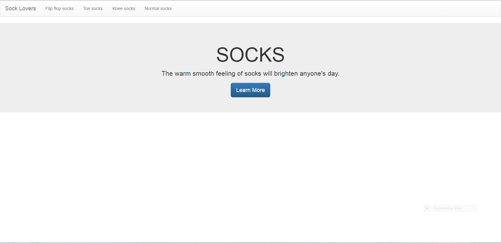

And since we put in that extra work to make it collapsible, on small screens and mobile the navbar looks like this:

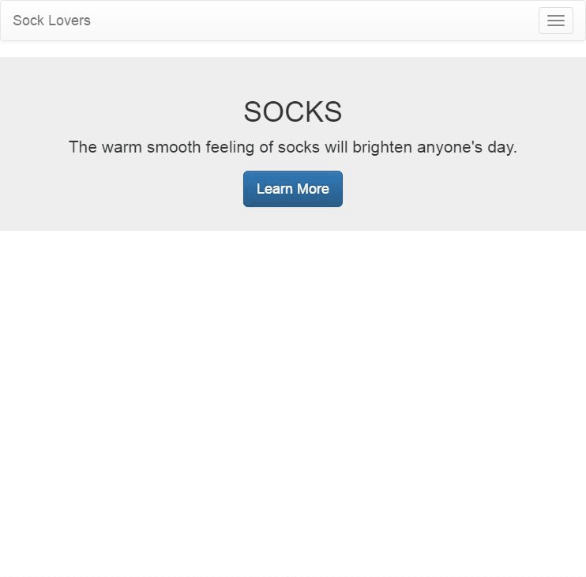

Congratulations you have successfully used bootstrap to make a responsive navbar

### Using the Bootstrap Documentation

In order to use Bootstrap to it's fullest extent, you will need to be able to understand the documentation, to discover it's many capabilities

Documentation for a plugin or api can be used to learn about what you can do with it.  It is almost like a tutorial on how to use it, made by the people who made the plugin or API.

To find the bootstrap documentation, go to the [bootstrap website](http://getbootstrap.com/).

The "CSS" and "Components" tab will probably be the most helpful for you, starting off with bootstrap.

To get used to the documentation, let's walk through "labels" with bootstrap

Labels in bootstrap are like little info boxes, something like a "New" tag to show a new feature on your site

To start let's find where they talk about labels on the bootstrap site

First we will check the "CSS" tab:

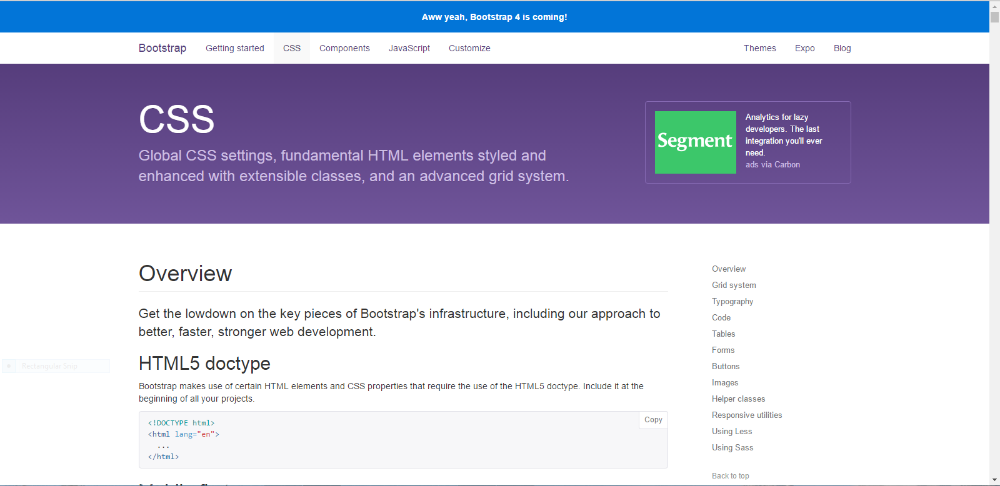

Next we should look at the sidebar to determine whether this page has what we are looking for:

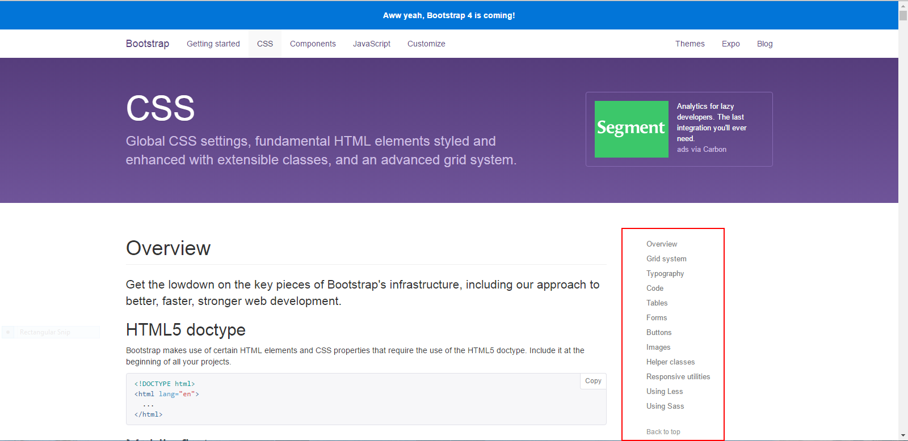

I don't know about you, but I don't see anything about labels

Now let's try the "Components" tab:

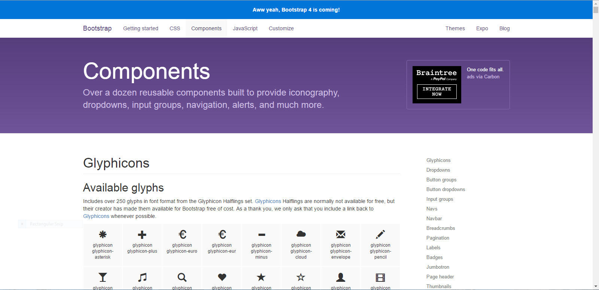

Now let's scroll down a bit and look at the sidebar

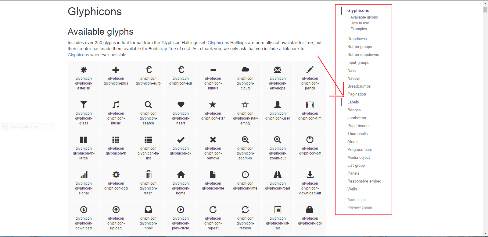

Looks like it's there

Click on that to scroll to that section of the page

The first thing you want to do is look at the example, and determine if this is the thing you are looking to add to your site

(Just in case the bootstrap site changes this is what we are working with):

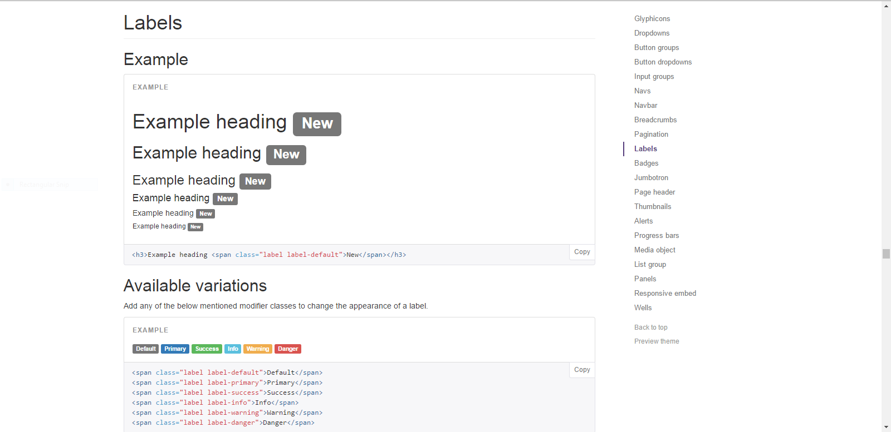

This looks like exactly what we wanted.

The next step is usually to read any notes written about the component, however it seems like the makers of bootstrap feel labels are self explanatory, so we can skip that step.

Now we should look at the code for how that example was created

```html
<h3>Example heading <span class="label label-default">New</span></h3>
```

Since they only provide one line, that must mean it works the same for every line.  We can assume that labels change size based on the text size of the line they are in.

It looks like they have some variations to apply to the labels, lets scroll down to look at those.

Just like before let's start by looking at what this section has to offer through the example.

(Just incase the site changes or you don't have access):

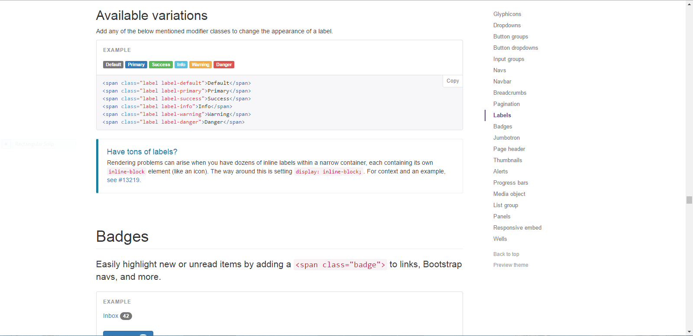

If you used this tutorial for adding the button, you should recognize these styles.  They are available with almost all of the bootstrap components that it would make sense to include them with.

I like that same primary style I used earlier, but feel free to choose any one you want.

Now we should read the note above the example.

> Add any of the below mentioned modifier classes to change the appearance of a label.

That seems simple enough, let's look at the code for the example

```html
<span class="label label-default">Default</span>
<span class="label label-primary">Primary</span>
<span class="label label-success">Success</span>
<span class="label label-info">Info</span>
<span class="label label-warning">Warning</span>
<span class="label label-danger">Danger</span>
```

This could seem like a lot at first, but if you look at it, you notice that each line is for a different label, so we would only need to use one line for our label

Just like earlier, all we have to do to add the style is add a class with the name of the component, a dash, and the name of the style.

It looks like there is also a helpful tidbit underneath the code,

>Rendering problems can arise when you have dozens of inline labels within a narrow container, each containing its own inline-block element (like an icon). The way around this is setting display: inline-block;. For context and an example, [see #13219](https://github.com/twbs/bootstrap/issues/13219).

I don't plan to add dozens of labels in one line, but if I did, this would definitely be something to keep in mind.

Now it starts talking about badges, seems like we know everything about labels that the documentation has to teach.  Now let's add a label to our site.

I am going to add another link on my navbar, just like before using

```html
<li><a href="#">NAME OF LINK</a></li>
```

Just like before.

Now we can add the label in the way that the documentation taught us

Try adding it yourself, and if you have trouble, no problem, you are still learning, it takes time to get the hang of it.  I will teach how to do it, under this image of how the site looks now.

This is how my site looks now:

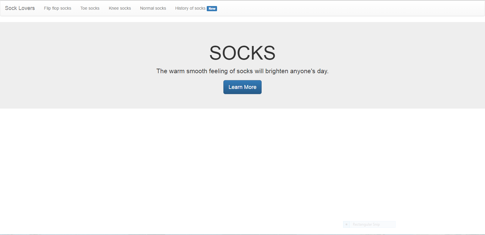

For anyone who got a bit stuck, no problem, here is how to do it

Inside of your anchor (a) element, add the following code :

```html
<span class = "label label-primary"> New </span>
```

You can replace -primary with the style that you want, and New with what you want the label to say

Congratulations, you now know how to use the bootstrap documentation to teach yourself more about this powerful framework.

If you are looking to practice using the documentation, I would recommend the grid system, if you are looking for a bit of a challenge at first, but something REALLY useful.  Another useful feature would be dropdowns for anyone looking for something slightly easier to understand, but equally applicable.

## Troubleshooting
- **Nothing shows up**
 - Try saving the `index.html` file from `File > Save`. After that reload the
   preview.
- **CSS not centering the jumbotron**
 - Make sure the `href` attribute of the `<link>` element in `index.html`
   points to a file in the same directory at as `index.html` called
   `style.css`.
 - Make sure you have a CSS file called `style.css`.
- **JavaScript is not sending you to the site**
 - Make sure the `src` attribute of the `<src>` element in `index.html` points
   to a file in the same directory at as `index.html` called `index.js`.
 - Make sure you have a JavaScript file called `index.js`.
 - Make sure the `id` attribute of the `<button>` in `index.html` is the same
   as the id being selected in the `document.getElementById` function in your
   `index.js` file (minus the `#`). ID's ARE case sensitive!
- **Bootstrap styles are not working**
 - Make sure that if you downloaded bootstrap the paths to the files are pointing directly to where
   you saved the files
 - If you used a Content Delivery Network make sure the link is the same as the one above, character
   for character, and (highly) consider copying and pasting if you did not already.
 - Check that your link to the JQuery CDN is correct
 - Attempt to use the opposite method then the one that you are currently trying
 - If you have tried everything above consider looking for a new bootstrap content delivery network,
   by checking the "Getting Started" section of their [site](http://getbootstrap.com/), or by using your
   favorite search engine to look up "Bootstrap CDN".  Link to that new CDN in the same way, just replace the urls
   and include any attributes to the script and link elements that the site suggests.  Also add in JQuery, in a version
   under 3, if you are using Bootstrap 3.  If the link I provided above no longer works check out their site [here](http://jquery.com/download/).
- **One specific Bootstrap style is not working (or multiple styles, while at least one is working)**
 - First double check for typos in the class names, it seems silly, but it really does make a huge difference.
 - If it still isn't working check the [bootstrap documentation](http://getbootstrap.com/components/) and see if the feature was removed, deprecated, or changed.
 - [here](http://output.jsbin.com/hodefediye/1) is a link to a jsbin of my sock site.  If it doesn't work there, you know it is an issue with bootstrap, since this worked
   last time that I checked.  This could mean many things, if you checked the documentation, and the feature has not been changed or removed, you can consider leaving an "issue" on  the github for bootstrap.  The link to post an issue is right [here](https://github.com/twbs/bootstrap/issues).  This will tell the developers of bootstrap that there is a problem with it, that they should look into.

## Congratulations
You now know how to
- Create a jumbotron for your site with bootstrap
- Create stylish buttons with bootstrap
- Create a responsive navbar with bootstrap
- Navigate the bootstrap documentation to teach yourself about it's other capabilities

Time to Celebrate!!!


TODO: Add Rating System
